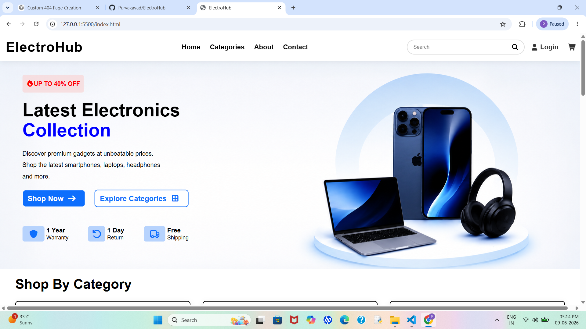
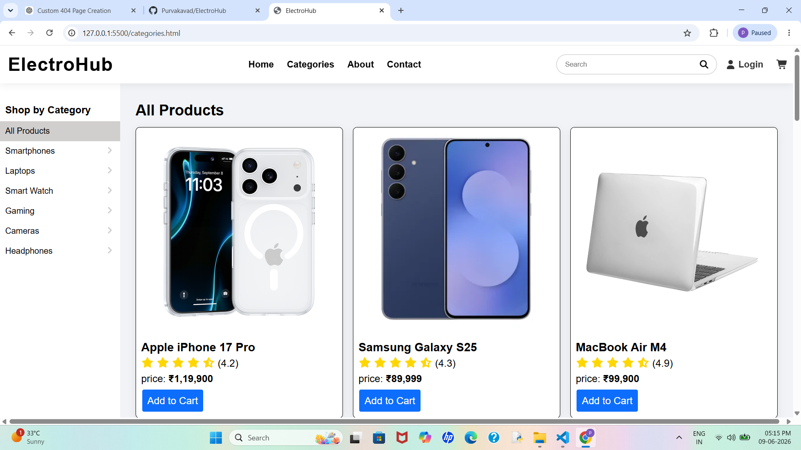
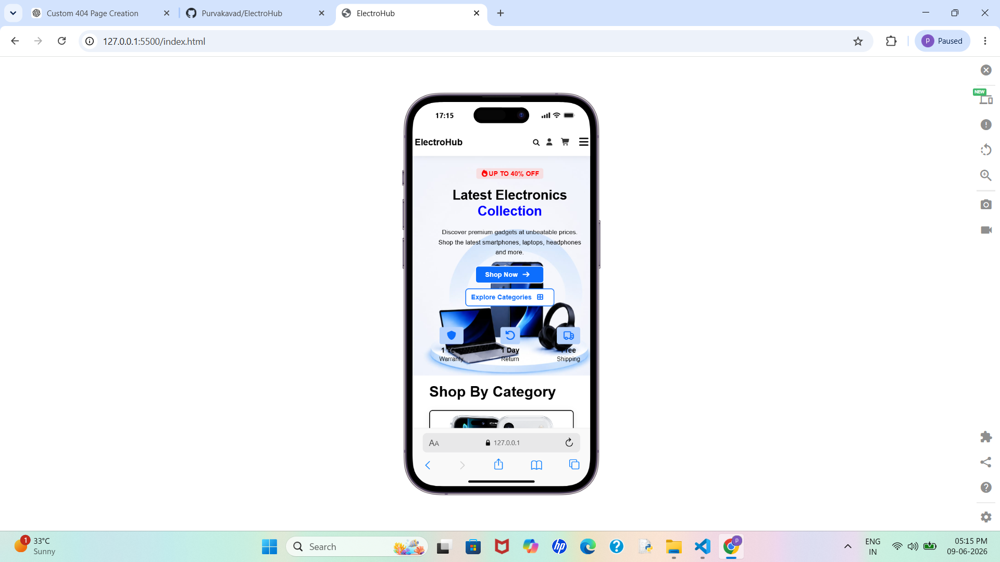

# ElectroHub

A modern and responsive e-commerce website built using HTML, CSS, and JavaScript.

## Live Demo

https://Purvakavad.github.io/ElectroHub/

## Features

* Responsive Design
* Modern User Interface
* Product Categories
* Product Listing Page
* Shopping Cart UI
* Search Bar
* Mobile-Friendly Layout
* Clean Navigation

## Technologies Used

* HTML5
* CSS3
* JavaScript

## Project Structure

ElectroHub/
│
├── index.html
├── categories.html
├── cart.html
├── about.html
├── contact.html
├── cart.html
├── login.html
├── regsiter.html
├── order_success.html
│
├── css/
│   └── style.css
    └── responsive.css
    └── home.css
    └── about.css
    └── category.css
    └── contact.css
    └── cart.css
    └── form.css
    └── oredr-success.css
│
├── js/
│   └── script.js
    └── cart.js
    └── addtocart.js
    └── category.js
    └── form.js
    └── loadcomponent.js
│
├── components/
    └── header.html
    └── footer.html
│
├── images/
│
└── README.md

## Screenshots

### Home Page

### Categories Page

### Mobile View

## Future Improvements

* Product Search Functionality
* Product Filters
* Product Detail Page
* Local Storage Cart

## Learning Outcomes

Through this project, I practiced:

* Responsive Web Design
* CSS Flexbox & Grid
* JavaScript DOM Manipulation
* Website Structure & Navigation
* UI/UX Design Principles
* Git & GitHub Workflow

## Author

**Purva Kavad**

BCA Student | Aspiring Full Stack Web Developer

LinkedIn:
https://www.linkedin.com/in/purvakavad/

GitHub:
https://github.com/Purvakavad
